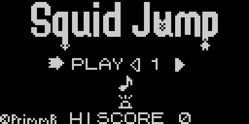
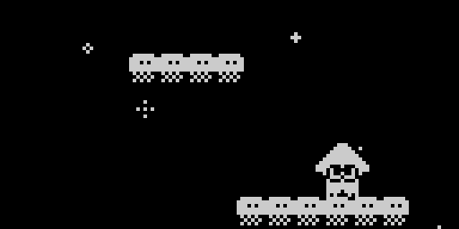
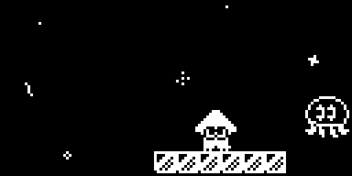
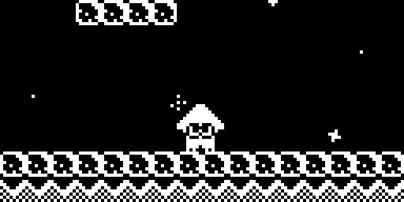
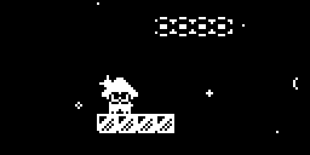

# Squid Jump

Squid Jump is a demake of the Squid Jump microgame from Splatoon, written for [Arduboy](https://www.arduboy.com).

The game features 25 levels, each of which contain a variety of platforms and powerups from the original version. Highscores and level checkpoint unlocks are saved to EEPROM (at addresses 500-506 incl.) so nothing should be lost when you turn off the device.

The game is intended to be played as a 'High Score Chasing' game and is categorised as *Arcade* in the Arduboy categories. That being said, play the game in whatever way is the most fun, as that's its true goal!!

## Controls

**A Button (Hold)** - Charge Jump

**A Button (Release)** - Jump

**L + R Buttons** - Move

**B Button** - Pause

**Up Button (Hold When Paused)** - Quit game + save

**A Button** - Select menu option

## How To Play

If you have an Arduboy device, you can flash either the .arduboy or .hex file to your device using an uploader such as [Arduboy Uploader](https://github.com/eried/ArduboyUploader).

Alternatively if you don't own an Arduboy device, you can emulate it on a variety of platforms, however some emulators may not save, so you may find yourself having to play from level 1 after quitting.

The emulator that I used to test the game was [Ardens](https://github.com/tiberiusbrown/Ardens/).

## Gallery

